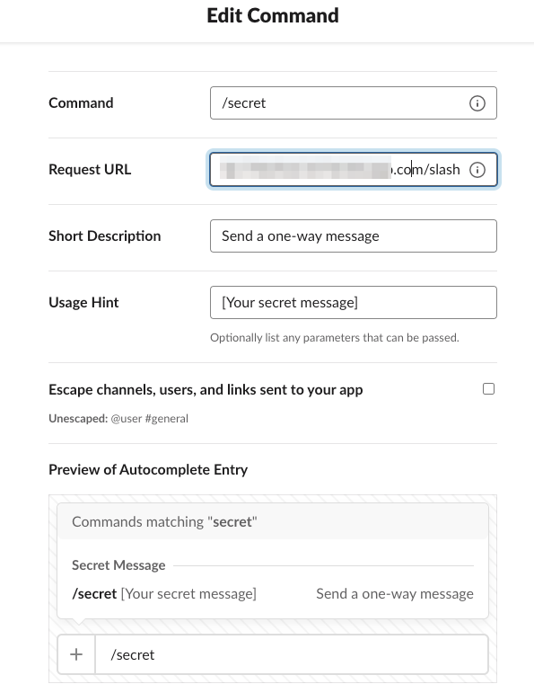
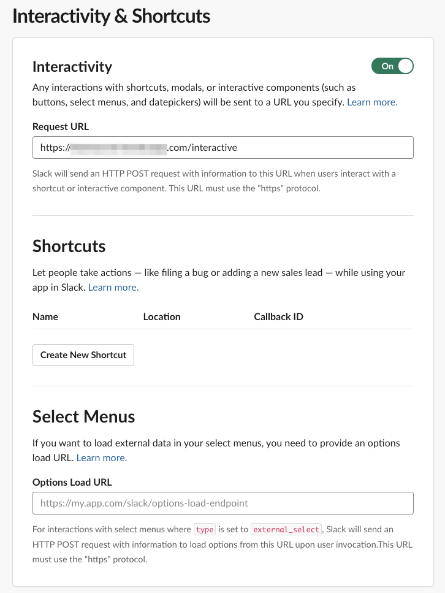
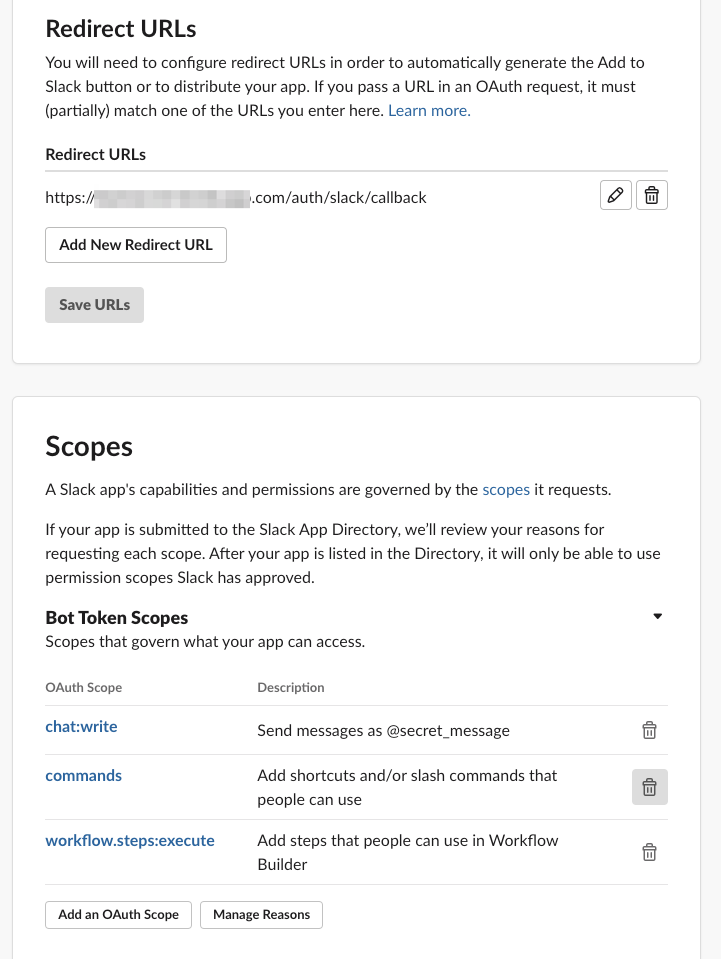

# Secret Message </img>


#### Notice:
Forked from [HERE](https://github.com/neufeldtech/secret-message)

---

 Send one-way messages through Slack

---

## Table of Contents :
  - [Prerequisites and setup](#prerequisites-and-setup)
    - [Slack app setup](#slack-app-setup)
    - [Setup bot config file](#setup-bot-config-file)
    - [Build and run the app](#build-and-run-the-app)
  - [Send a secret message](#send-a-secret-message)
  - [Read a secret message](#read-a-secret-message)
  - [License](#license)


---

## Prerequisites and setup

### Slack app setup

> Note that you will need your application to be exposed in order to setup correctly the requested callback URLs and so on

- Create a new app from [Slack api](https://api.slack.com/apps)
- Setup slash command from https://api.slack.com/apps/{APP_ID}/slash-commands 
- Set interactivity URL from https://api.slack.com/apps/${APP_ID}/interactive-messages 
- Set redirect URLs and bot scopes from https://api.slack.com/apps/${APP_ID}/oauth 

### Setup bot config file
The config file is handled [here](config/config.yaml)
```yaml
slack:
  appURL:               # Base URL of the bot
  signingSecret:        # Slack signing secret (https://api.slack.com/apps/${APP_ID}/general)
  clientID:             # Slack client ID (https://api.slack.com/apps/${APP_ID}/general)
  clientSecret:         # Slack client secret (https://api.slack.com/apps/${APP_ID}/general)
  callbackURL:          # Callback URL (https://${APP_URL}/auth/slack/callback)
  token:                # Slack verification token (https://api.slack.com/apps/${APP_ID}/general)
server:
  port:                 # Bot webserver port
database:
  name:                 # Database name
  host:                 # Database host/address
  username:             # Database user
  password:             # Database password
core:
  cryptoKey:            # Message hashing string
  expirationTime:       # Expiration time of message in database (in seconds)
```

### Build and run the app
> Build requires GNU Make and golang (tested using go **1.18.4**)\
> The application requires also a Postgres database.
- Build the app `make build`
- Run the app `./secretmessage`

For Slack to be able to send data thru application callbacks, the application must be publicly hosted. It can be tested using tools such as `ngrok` for TCP tunneling.

---

## Send a secret message
Just type /secret and your message, such as ```/secret I'm scared of heights```


---

## Read a secret message
To read a secret message, just click on the View message button. The message will appear as an ephemeral Slack message visable to only you - it will disappear when you reload your Slack client.


---

## License
The MIT License (MIT)
Copyright (c) 2016 Jordan Neufeld

Permission is hereby granted, free of charge, to any person obtaining a copy of this software and associated documentation files (the "Software"), to deal in the Software without restriction, including without limitation the rights to use, copy, modify, merge, publish, distribute, sublicense, and/or sell copies of the Software, and to permit persons to whom the Software is furnished to do so, subject to the following conditions:

The above copyright notice and this permission notice shall be included in all copies or substantial portions of the Software.

THE SOFTWARE IS PROVIDED "AS IS", WITHOUT WARRANTY OF ANY KIND, EXPRESS OR IMPLIED, INCLUDING BUT NOT LIMITED TO THE WARRANTIES OF MERCHANTABILITY, FITNESS FOR A PARTICULAR PURPOSE AND NONINFRINGEMENT. IN NO EVENT SHALL THE AUTHORS OR COPYRIGHT HOLDERS BE LIABLE FOR ANY CLAIM, DAMAGES OR OTHER LIABILITY, WHETHER IN AN ACTION OF CONTRACT, TORT OR OTHE
